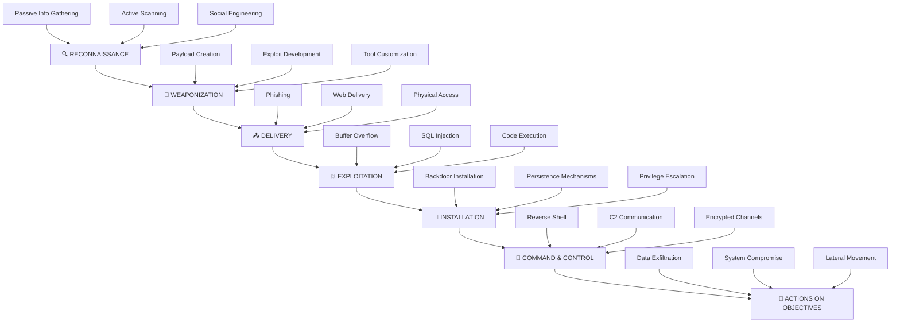

```
    ▄▄▄▄▄▄▄▄▄▄▄▄▄▄▄▄▄▄▄▄▄▄▄▄▄▄▄▄▄▄▄▄▄▄▄▄▄▄▄▄▄▄▄▄▄▄▄▄▄▄▄▄▄▄▄▄▄▄▄▄▄▄▄▄▄▄▄▄▄▄▄▄▄▄▄▄▄▄▄▄
    ██ ▄▄▄▄▄ ██▄██ ▄▄▄██ ▄▄▄ ██ ▄▄▄▄▄ ██ ▄▄▄▄▄ ██ ▄▄▄▄▄ ██ ▄▄▄▄▄ ██ ▄▄▄▄▄ ██ ▄▄▄▄▄ ██
    ██ ██▄▄▄ ██ ██ █████ ███ ██ ██▄▄▄ ██ ██▄▄▄ ██ ██▄▄▄ ██ ██▄▄▄ ██ ██▄▄▄ ██ ██▄▄▄ ██
    ██ ▀▀▀▀▀ ██▀▀▀ ▀▀▀██ ▀▀▀ ██ ▀▀▀▀▀ ██ ▀▀▀▀▀ ██ ▀▀▀▀▀ ██ ▀▀▀▀▀ ██ ▀▀▀▀▀ ██ ▀▀▀▀▀ ██
    ▀▀▀▀▀▀▀▀▀▀▀▀▀▀▀▀▀▀▀▀▀▀▀▀▀▀▀▀▀▀▀▀▀▀▀▀▀▀▀▀▀▀▀▀▀▀▀▀▀▀▀▀▀▀▀▀▀▀▀▀▀▀▀▀▀▀▀▀▀▀▀▀▀▀▀▀▀▀▀▀

    ████████╗██╗  ██╗███████╗    ███████╗██╗     ██╗████████╗███████╗     █████╗  ██████╗ █████╗ ██████╗ ███████╗███╗   ███╗██╗   ██╗
    ╚══██╔══╝██║  ██║██╔════╝    ██╔════╝██║     ██║╚══██╔══╝██╔════╝    ██╔══██╗██╔════╝██╔══██╗██╔══██╗██╔════╝████╗ ████║╚██╗ ██╔╝
       ██║   ███████║█████╗      █████╗  ██║     ██║   ██║   █████╗      ███████║██║     ███████║██║  ██║█████╗  ██╔████╔██║ ╚████╔╝
       ██║   ██╔══██║██╔══╝      ██╔══╝  ██║     ██║   ██║   ██╔══╝      ██╔══██║██║     ██╔══██║██║  ██║██╔══╝  ██║╚██╔╝██║  ╚██╔╝
       ██║   ██║  ██║███████╗    ███████╗███████╗██║   ██║   ███████╗    ██║  ██║╚██████╗██║  ██║██████╔╝███████╗██║ ╚═╝ ██║   ██║
       ╚═╝   ╚═╝  ╚═╝╚══════╝    ╚══════╝╚══════╝╚═╝   ╚═╝   ╚══════╝    ╚═╝  ╚═╝ ╚═════╝╚═╝  ╚═╝╚═════╝ ╚══════╝╚═╝     ╚═╝   ╚═╝
```

<div align="center">

# ⚡ **THE ULTIMATE CYBERSECURITY WARFARE ACADEMY** ⚡

### 🔥 *From Script Kiddie to Elite Gray-Hat Operator* 🔥


</div>

---

## 🎯 **MISSION BRIEFING**

```
┌─────────────────────────────────────────────────────────────────────────────┐
│  🚨 CLASSIFIED: ADVANCED CYBER WARFARE TRAINING PROGRAM 🚨                 │
│                                                                             │
│  ⚠️  WARNING: This repository contains advanced offensive security          │
│      techniques used by elite penetration testers and ethical hackers.     │
│      Knowledge is power - use it responsibly.                              │
│                                                                             │
│  🎯 OBJECTIVE: Transform ordinary individuals into cyber warfare operators  │
│      capable of identifying, exploiting, and securing digital assets.      │
└─────────────────────────────────────────────────────────────────────────────┘
```

**Jir-Course** adalah akademi pelatihan cybersecurity paling komprehensif yang dirancang untuk mengubah pemula menjadi operator keamanan siber elit. Dari teknik bypass EDR hingga post-exploitation advanced, course ini memberikan pemahaman mendalam tentang metodologi hacking yang digunakan dalam operasi dunia nyata.

### 🔥 **WHAT MAKES THIS DIFFERENT?**

- **💀 REAL-WORLD TECHNIQUES**: Bukan teori kosong - semua teknik telah terbukti di lapangan
- **⚡ HANDS-ON APPROACH**: Setiap modul dilengkapi dengan lab praktis dan automation tools
- **🛡️ ETHICAL FRAMEWORK**: Fokus pada defensive security dan responsible disclosure
- **🎯 PROGRESSIVE LEARNING**: Dari basic reconnaissance hingga advanced persistence
- **🔓 OPEN SOURCE**: Semua tools dan teknik dapat diverifikasi dan dikustomisasi

## ⚔️ **CYBER KILL CHAIN METHODOLOGY**



## ⚠️ **ETHICAL DISCLAIMER & LEGAL NOTICE**

```
╔══════════════════════════════════════════════════════════════════════════════╗
║  🚨 CRITICAL WARNING: AUTHORIZED USE ONLY 🚨                                ║
║                                                                              ║
║  This repository contains advanced offensive security techniques that       ║
║  can cause significant damage if misused. By accessing this content,        ║
║  you agree to:                                                               ║
║                                                                              ║
║  ✅ Use techniques ONLY on systems you own or have explicit permission      ║
║  ✅ Follow responsible disclosure practices                                  ║
║  ✅ Respect privacy and data protection laws                                ║
║  ✅ Use knowledge for defensive and educational purposes                     ║
║                                                                              ║
║  ❌ UNAUTHORIZED ACCESS TO COMPUTER SYSTEMS IS ILLEGAL                      ║
║  ❌ AUTHORS ARE NOT RESPONSIBLE FOR MISUSE OF THIS INFORMATION              ║
║                                                                              ║
║  "With great power comes great responsibility" - Uncle Ben                  ║
╚══════════════════════════════════════════════════════════════════════════════╝
```

## 🎯 **OPERATOR SKILL PROGRESSION MATRIX**

```
┌─────────────────────────────────────────────────────────────────────────────┐
│                    SKILL LEVEL PROGRESSION CHART                           │
├─────────────────────────────────────────────────────────────────────────────┤
│                                                                             │
│  SCRIPT KIDDIE ──────► JUNIOR PENTESTER ──────► SENIOR OPERATOR ──────► ELITE │
│       🐣                    🔰                      ⚡                   💀   │
│                                                                             │
│  • Basic tools          • Manual testing        • Advanced techniques    • 0-day │
│  • Copy-paste           • Report writing        • Custom exploits       • Research │
│  • No methodology      • Basic methodology     • Automation mastery    • Teaching │
│                                                                             │
└─────────────────────────────────────────────────────────────────────────────┘
```

### 🏆 **LEARNING OBJECTIVES & SKILL ACQUISITION**

Setelah menyelesaikan akademi ini, operator akan memiliki kemampuan:

#### 🔥 **OFFENSIVE CAPABILITIES**
- **🛡️ EDR Evasion Mastery**: Bypass sistem deteksi endpoint terdepan
- **⚡ Advanced Persistence**: Mempertahankan akses dalam jangka panjang
- **🎯 Precision Exploitation**: Mengeksploitasi kerentanan dengan akurasi tinggi
- **🔄 Stealth Operations**: Beroperasi tanpa terdeteksi oleh blue team
- **🌐 Network Infiltration**: Lateral movement dan privilege escalation

#### 🛡️ **DEFENSIVE UNDERSTANDING**
- **🔍 Threat Hunting**: Mengidentifikasi indikator kompromi
- **📊 Log Analysis**: Memahami jejak digital yang ditinggalkan attacker
- **🚨 Incident Response**: Merespons dan mitigasi serangan
- **🔒 Hardening Techniques**: Memperkuat sistem dari serangan
- **📈 Risk Assessment**: Menilai dan memprioritaskan risiko keamanan

#### 🤖 **AUTOMATION & TOOLING**
- **⚙️ Custom Tool Development**: Membuat tools sesuai kebutuhan spesifik
- **🔧 Script Automation**: Mengotomatisasi proses testing dan exploitation
- **📡 C2 Framework Mastery**: Menguasai command and control frameworks
- **🎪 Payload Crafting**: Membuat payload yang dapat melewati deteksi
- **🔬 Research Methodology**: Melakukan research keamanan independen

## 📚 **ACADEMY CURRICULUM ARCHITECTURE**

```
                    🏛️ JIR-COURSE ACADEMY STRUCTURE 🏛️

    ┌─────────────────────────────────────────────────────────────────┐
    │                    FOUNDATION LAYER                             │
    │  🔍 Reconnaissance ──► 🎯 Vulnerability Analysis ──► 💥 Exploitation │
    └─────────────────────────────────────────────────────────────────┘
                                    │
    ┌─────────────────────────────────────────────────────────────────┐
    │                   INTERMEDIATE LAYER                            │
    │  🛡️ EDR Bypass ──► 🔄 Reverse Shell ──► 🔒 Persistence         │
    └─────────────────────────────────────────────────────────────────┘
                                    │
    ┌─────────────────────────────────────────────────────────────────┐
    │                    ADVANCED LAYER                               │
    │  🌐 JS Enumeration ──► 🛡️ Shell Defense ──► 🎪 Post-Exploitation │
    └─────────────────────────────────────────────────────────────────┘
                                    │
    ┌─────────────────────────────────────────────────────────────────┐
    │                     MASTERY LAYER                               │
    │           🤖 Automation Tools ──► 📚 Resources                  │
    └─────────────────────────────────────────────────────────────────┘
```

### 🎓 **DETAILED CURRICULUM BREAKDOWN**

#### 🛡️ **[MODULE 01: EDR BYPASS WARFARE](./01-EDR-Bypass/)** `[DIFFICULTY: ⚡⚡⚡⚡⚡]`

```
┌─ EDR BYPASS TECHNIQUES ─────────────────────────────────────────────┐
│                                                                     │
│  🎯 MISSION: Evade the most advanced endpoint detection systems     │
│                                                                     │
│  📋 ARSENAL:                                                        │
│  ├── 🔧 Binary Obfuscation & Packing                               │
│  ├── 💉 Process Injection & Hollowing                              │
│  ├── 🌐 Network Traffic Obfuscation                                │
│  ├── 🎭 Anti-Analysis Techniques                                   │
│  └── 🔬 Real-World Case Studies                                    │
│                                                                     │
│  ⚡ SKILLS GAINED:                                                  │
│  • Master advanced evasion techniques                              │
│  • Understand EDR detection mechanisms                             │
│  • Develop custom evasion tools                                    │
│  • Implement stealth persistence                                   │
│                                                                     │
└─────────────────────────────────────────────────────────────────────┘
```

#### 🔄 **[MODULE 02: REVERSE SHELL MASTERY](./02-Reverse-Shell/)** `[DIFFICULTY: ⚡⚡⚡⚡]`

```
┌─ REVERSE SHELL COMMAND CENTER ─────────────────────────────────────┐
│                                                                     │
│  🎯 MISSION: Establish persistent command & control channels       │
│                                                                     │
│  📋 COMMUNICATION ARSENAL:                                          │
│  ├── 🌐 Gsocket: Encrypted P2P connections                         │
│  ├── 🚇 Ngrok: HTTP/TCP tunneling mastery                          │
│  ├── ⚡ FRP: Fast reverse proxy deployment                          │
│  ├── 🔧 Custom payload generation                                  │
│  └── 🛡️ Anti-forensics techniques                                  │
│                                                                     │
│  ⚡ OPERATIONAL CAPABILITIES:                                       │
│  • Bypass NAT and firewall restrictions                            │
│  • Establish encrypted communication channels                      │
│  • Implement redundant C2 infrastructure                           │
│  • Master payload obfuscation techniques                           │
│                                                                     │
└─────────────────────────────────────────────────────────────────────┘
```

#### 🔒 **[MODULE 03: PERSISTENCE WARFARE](./03-Persistence/)** `[DIFFICULTY: ⚡⚡⚡⚡⚡]`

```
┌─ PERSISTENCE & STEALTH OPERATIONS ─────────────────────────────────┐
│                                                                     │
│  🎯 MISSION: Maintain long-term access without detection           │
│                                                                     │
│  📋 PERSISTENCE TOOLKIT:                                            │
│  ├── ⏰ Advanced Cron Job Techniques                               │
│  ├── 🔑 SSH Key Management & Stealth                               │
│  ├── 👤 Backdoor User Creation                                     │
│  ├── 🧹 Anti-Forensics & Log Evasion                              │
│  └── 🔄 Self-Healing Mechanisms                                    │
│                                                                     │
│  ⚡ STEALTH MASTERY:                                                │
│  • Implement undetectable persistence                              │
│  • Master log manipulation techniques                              │
│  • Create self-maintaining backdoors                               │
│  • Develop counter-forensics skills                                │
│                                                                     │
└─────────────────────────────────────────────────────────────────────┘
```

### 🌐 [04-JavaScript-Enumeration](./04-JavaScript-Enumeration/)
Enumerasi dan analisis JavaScript untuk bug bounty
- **Tools**: Tools untuk analisis JS files
- **Automation Scripts**: Script otomatis untuk enumerasi
- **Examples**: Contoh temuan dari JS enumeration

### 🛡️ [05-Shell-Defense](./05-Shell-Defense/)
Teknik menyembunyikan dan mempertahankan web shell
- **Hiding Techniques**: Cara menyembunyikan shell dari deteksi
- **Obfuscation**: Teknik obfuscation untuk shell
- **Backdoor Methods**: Berbagai metode backdoor

### 🔍 [06-Reconnaissance](./06-Reconnaissance/)
Tahap pengumpulan informasi target
- **Subdomain Enumeration**: Mencari subdomain target
- **Port Scanning**: Scanning port dan service
- **Google Dorking**: Teknik pencarian dengan Google

### 🔓 [07-Vulnerability-Analysis](./07-Vulnerability-Analysis/)
Analisis dan identifikasi kerentanan
- **SQL Injection**: Teknik dan bypass SQL injection
- **XSS**: Cross-Site Scripting techniques
- **File Upload**: Bypass file upload restrictions
- **WAF Bypass**: Teknik melewati Web Application Firewall

### ⚡ [08-Exploitation](./08-Exploitation/)
Eksploitasi kerentanan yang ditemukan
- **Web Shells**: Berbagai jenis web shell
- **Payload Obfuscation**: Mengaburkan payload
- **Exploit Techniques**: Teknik eksploitasi lanjutan

### 🎯 [09-Post-Exploitation](./09-Post-Exploitation/)
Aktivitas setelah mendapatkan akses awal
- **Pivoting**: Teknik lateral movement
- **SSH Tunneling**: Tunneling untuk akses internal
- **Privilege Escalation**: Eskalasi privilege

### 🤖 [10-Automation-Tools](./10-Automation-Tools/)
Tools dan script untuk otomasi
- **Installation Guides**: Panduan instalasi tools
- **Tool Configs**: Konfigurasi tools
- **Custom Scripts**: Script custom untuk otomasi

### 📖 [Resources](./Resources/)
Sumber daya tambahan
- **Cheat Sheets**: Ringkasan perintah penting
- **Wordlists**: Daftar kata untuk bruteforce
- **References**: Referensi dan dokumentasi

## 🚀 **OPERATOR DEPLOYMENT GUIDE**

### 🎯 **LEARNING PATHS & SPECIALIZATIONS**

```
┌─ LEARNING PATH MATRIX ─────────────────────────────────────────────┐
│                                                                     │
│  🔰 BEGINNER PATH (3-6 months)                                     │
│  ├── 06-Reconnaissance → 07-Vulnerability-Analysis                 │
│  ├── 08-Exploitation → 02-Reverse-Shell                            │
│  └── 03-Persistence → 10-Automation-Tools                          │
│                                                                     │
│  ⚡ INTERMEDIATE PATH (6-12 months)                                 │
│  ├── 01-EDR-Bypass → 04-JavaScript-Enumeration                     │
│  ├── 05-Shell-Defense → 09-Post-Exploitation                       │
│  └── Advanced Automation & Custom Tool Development                 │
│                                                                     │
│  💀 EXPERT PATH (12+ months)                                       │
│  ├── 0-day Research & Exploit Development                          │
│  ├── Advanced Persistence & APT Simulation                         │
│  └── Red Team Leadership & Methodology Development                 │
│                                                                     │
└─────────────────────────────────────────────────────────────────────┘
```

### 🏗️ **DEPLOYMENT PROCEDURES**

#### **PHASE 1: RECONNAISSANCE & SETUP**
```bash
# 🔥 Clone the academy repository
git clone https://github.com/el-pablos/Jir-Course.git
cd Jir-Course

# 🛡️ Verify integrity and setup environment
chmod +x setup.sh && ./setup.sh
```

#### **PHASE 2: LAB ENVIRONMENT CONSTRUCTION**
```bash
# 🎯 Recommended lab setup
┌─ VIRTUAL INFRASTRUCTURE ─────────────────────────────────────────┐
│  🖥️  Kali Linux (Attacker Machine)                              │
│  🎯 Metasploitable 2/3 (Target Practice)                        │
│  🌐 DVWA, WebGoat (Web Application Testing)                     │
│  🔒 Windows 10/11 (EDR Testing Environment)                     │
│  📡 pfSense (Network Segmentation)                              │
└───────────────────────────────────────────────────────────────────┘
```

#### **PHASE 3: SKILL PROGRESSION TRACKING**
```bash
# 📊 Progress monitoring system
├── Beginner Challenges (25 labs)
├── Intermediate CTFs (15 scenarios)
├── Advanced Red Team Exercises (10 campaigns)
└── Expert Research Projects (5 0-days)
```

## 📋 **OPERATOR PREREQUISITES & REQUIREMENTS**

### 🧠 **COGNITIVE REQUIREMENTS**
```
┌─ MENTAL FRAMEWORK ASSESSMENT ─────────────────────────────────────┐
│                                                                     │
│  🎯 REQUIRED MINDSET:                                              │
│  ├── 🔍 Analytical thinking & problem-solving                      │
│  ├── 🎪 Creative approach to complex challenges                    │
│  ├── 🛡️ Ethical responsibility & professional integrity            │
│  ├── 📚 Continuous learning & adaptation                           │
│  └── 🔥 Passion for cybersecurity excellence                       │
│                                                                     │
│  ⚡ TECHNICAL FOUNDATION:                                           │
│  ├── 🐧 Linux/Unix system administration                           │
│  ├── 🌐 TCP/IP networking fundamentals                             │
│  ├── 💻 Command line proficiency                                   │
│  ├── 🔧 Basic programming (Python, Bash, PowerShell)              │
│  └── 🏗️ Virtualization & containerization                         │
│                                                                     │
└─────────────────────────────────────────────────────────────────────┘
```

### 🛠️ **TECHNICAL INFRASTRUCTURE REQUIREMENTS**

#### **MINIMUM HARDWARE SPECIFICATIONS**
```
┌─ HARDWARE REQUIREMENTS ───────────────────────────────────────────┐
│                                                                     │
│  💻 WORKSTATION SPECS:                                             │
│  ├── CPU: Intel i5/AMD Ryzen 5 (8+ cores recommended)            │
│  ├── RAM: 16GB minimum (32GB recommended)                          │
│  ├── Storage: 500GB SSD (1TB+ recommended)                        │
│  ├── Network: Gigabit Ethernet + WiFi                             │
│  └── GPU: Dedicated GPU for password cracking (optional)          │
│                                                                     │
│  🔧 VIRTUALIZATION PLATFORM:                                       │
│  ├── VMware Workstation Pro / VirtualBox                          │
│  ├── Docker & Kubernetes                                           │
│  ├── Proxmox (for advanced lab setups)                            │
│  └── Cloud platforms (AWS, Azure, GCP)                            │
│                                                                     │
└─────────────────────────────────────────────────────────────────────┘
```

## 🛠️ **ARSENAL & WEAPONIZATION TOOLKIT**

### ⚔️ **OFFENSIVE SECURITY ARSENAL**

```
┌─ RECONNAISSANCE DIVISION ─────────────────────────────────────────┐
│  🔍 Intelligence Gathering                                         │
│  ├── 🌐 subfinder, amass, assetfinder (Subdomain enumeration)     │
│  ├── 🎯 nmap, masscan, zmap (Port scanning & service detection)   │
│  ├── 🕷️ katana, hakrawler, gospider (Web crawling)                │
│  ├── 📊 httpx, httprobe (HTTP probing & analysis)                 │
│  └── 🔎 shodan, censys, zoomeye (OSINT platforms)                 │
└─────────────────────────────────────────────────────────────────────┘

┌─ EXPLOITATION FRAMEWORK ──────────────────────────────────────────┐
│  💥 Vulnerability Assessment & Exploitation                        │
│  ├── 🎪 Metasploit Framework (Comprehensive exploitation)          │
│  ├── 🔓 sqlmap, NoSQLMap (Database exploitation)                  │
│  ├── 🌐 Burp Suite Professional (Web application testing)         │
│  ├── ⚡ nuclei, jaeles (Automated vulnerability scanning)          │
│  └── 🔧 Custom exploit development tools                          │
└─────────────────────────────────────────────────────────────────────┘

┌─ COMMAND & CONTROL INFRASTRUCTURE ────────────────────────────────┐
│  🔄 C2 & Communication Systems                                     │
│  ├── 🌐 Gsocket (Encrypted P2P communication)                     │
│  ├── 🚇 Ngrok, FRP (Tunneling & proxy solutions)                  │
│  ├── 👑 Cobalt Strike, Empire (Advanced C2 frameworks)            │
│  ├── 🔧 Custom C2 development (Python, Go, C++)                   │
│  └── 🛡️ Anti-forensics & stealth tools                            │
└─────────────────────────────────────────────────────────────────────┘
```

### 🤖 **AUTOMATION & DEVELOPMENT STACK**

```
┌─ PROGRAMMING LANGUAGES ───────────────────────────────────────────┐
│  💻 Development & Scripting                                        │
│  ├── 🐍 Python (Primary automation & tool development)            │
│  ├── 🔧 Bash/Zsh (System automation & scripting)                  │
│  ├── ⚡ Go (High-performance tool development)                     │
│  ├── 💀 C/C++ (Low-level exploitation & rootkits)                 │
│  └── 🌐 JavaScript (Web application testing & XSS)                │
└─────────────────────────────────────────────────────────────────────┘

┌─ AUTOMATION FRAMEWORKS ───────────────────────────────────────────┐
│  🤖 Workflow & Process Automation                                  │
│  ├── 🔄 GitHub Actions (CI/CD & automated testing)                │
│  ├── 🐳 Docker & Kubernetes (Containerized environments)          │
│  ├── 📊 Ansible, Terraform (Infrastructure as Code)               │
│  ├── 🎯 Custom automation scripts & frameworks                    │
│  └── 🔧 API integration & webhook systems                         │
└─────────────────────────────────────────────────────────────────────┘
```

## 📞 **OPERATOR SUPPORT & COMMUNITY NETWORK**

### 🌐 **GLOBAL COMMUNITY CHANNELS**

```
┌─ COMMUNICATION NETWORKS ──────────────────────────────────────────┐
│                                                                     │
│  💬 REAL-TIME COMMUNICATION:                                       │
│  ├── 📱 Telegram: [Nexarium Elite Group](https://t.me/+SfN6YXOTwCgyNDY1) │
│  ├── 💬 Discord: [Jir-Course Academy](https://discord.gg/jircourse) │
│  ├── 🐦 Twitter: [@JirCourseAcademy](https://twitter.com/jircourse) │
│  └── 📧 Email: academy@jir-course.com                              │
│                                                                     │
│  🔧 TECHNICAL SUPPORT:                                             │
│  ├── 🐛 GitHub Issues: Bug reports & feature requests             │
│  ├── 📚 Wiki: Comprehensive documentation                          │
│  ├── 🎥 YouTube: Video tutorials & walkthroughs                   │
│  └── 📖 Blog: Latest research & techniques                        │
│                                                                     │
└─────────────────────────────────────────────────────────────────────┘
```

### 🏆 **COMMUNITY CONTRIBUTION SYSTEM**

```
┌─ CONTRIBUTION REWARDS ────────────────────────────────────────────┐
│                                                                     │
│  🥇 ELITE CONTRIBUTORS:                                            │
│  ├── 🔥 Original research & 0-day discoveries                     │
│  ├── 🛠️ Advanced tool development                                  │
│  ├── 📚 Educational content creation                               │
│  └── 🎯 Community mentorship & support                            │
│                                                                     │
│  🥈 ACTIVE CONTRIBUTORS:                                           │
│  ├── 🐛 Bug reports & fixes                                       │
│  ├── 📝 Documentation improvements                                 │
│  ├── 🔧 Script & automation contributions                         │
│  └── 💡 Feature suggestions & implementations                     │
│                                                                     │
│  🥉 COMMUNITY SUPPORTERS:                                          │
│  ├── ⭐ Repository stars & sharing                                 │
│  ├── 💬 Active community participation                            │
│  ├── 🎓 Mentoring newcomers                                       │
│  └── 📢 Promoting ethical hacking practices                       │
│                                                                     │
└─────────────────────────────────────────────────────────────────────┘
```

## 🙏 **HALL OF FAME & ACKNOWLEDGMENTS**

```
┌─ ACADEMY LEADERSHIP ──────────────────────────────────────────────┐
│                                                                     │
│  👑 SEKIYA                                                         │
│  ├── 🎯 Master Cybersecurity Practitioner                         │
│  ├── 🔥 Original Technical Content Creator                        │
│  ├── 🛡️ Elite Red Team Operator                                   │
│  └── 📚 Cybersecurity Education Pioneer                           │
│                                                                     │
│  🏗️ TAMAS                                                          │
│  ├── 📖 Repository Architect & Documentation Specialist           │
│  ├── 🤖 Automation Framework Developer                            │
│  ├── 🎨 User Experience & Interface Designer                      │
│  └── 🔧 Community Platform Administrator                          │
│                                                                     │
└─────────────────────────────────────────────────────────────────────┘
```

### 🌟 **SPECIAL ACKNOWLEDGMENTS**

**Terima kasih kepada komunitas cybersecurity global yang telah berkontribusi dalam pengembangan teknik-teknik yang terdokumentasi dalam akademi ini. Pengetahuan adalah kekuatan kolektif yang harus dibagi untuk kemajuan keamanan siber.**

## 📝 **CONTRIBUTION FRAMEWORK**

```
┌─ CONTRIBUTION GUIDELINES ─────────────────────────────────────────┐
│                                                                     │
│  🔥 ELITE TIER CONTRIBUTIONS:                                      │
│  ├── 🔬 Original vulnerability research & 0-day discoveries       │
│  ├── 🛠️ Advanced tool development & frameworks                     │
│  ├── 📚 Comprehensive educational modules                          │
│  └── 🎯 Red team methodology innovations                           │
│                                                                     │
│  ⚡ STANDARD CONTRIBUTIONS:                                         │
│  ├── 🐛 Bug reports with detailed reproduction steps              │
│  ├── 📝 Documentation improvements & translations                  │
│  ├── 🔧 Script optimizations & automation enhancements            │
│  └── 💡 Feature requests with implementation proposals            │
│                                                                     │
│  📋 CONTRIBUTION PROCESS:                                          │
│  ├── 1. Fork repository & create feature branch                   │
│  ├── 2. Implement changes with proper attribution                 │
│  ├── 3. Test thoroughly in isolated environment                   │
│  ├── 4. Submit pull request with detailed description             │
│  └── 5. Participate in code review & community feedback           │
│                                                                     │
└─────────────────────────────────────────────────────────────────────┘
```

## 📄 **LICENSE & LEGAL FRAMEWORK**

```
┌─ EDUCATIONAL LICENSE AGREEMENT ───────────────────────────────────┐
│                                                                     │
│  📜 LICENSE TYPE: Educational Use Only                             │
│  🎯 PERMITTED USES:                                                │
│  ├── ✅ Educational research & learning                            │
│  ├── ✅ Authorized penetration testing                             │
│  ├── ✅ Defensive security improvement                             │
│  └── ✅ Academic & professional development                        │
│                                                                     │
│  🚫 PROHIBITED USES:                                               │
│  ├── ❌ Unauthorized system access                                 │
│  ├── ❌ Malicious activities or cybercrime                         │
│  ├── ❌ Commercial exploitation without permission                 │
│  └── ❌ Violation of applicable laws & regulations                 │
│                                                                     │
└─────────────────────────────────────────────────────────────────────┘
```

---

<div align="center">

```
╔══════════════════════════════════════════════════════════════════════════════╗
║                                                                              ║
║  ⚡ "Knowledge is power, but with great power comes great responsibility" ⚡  ║
║                                                                              ║
║                    🔥 STAY ETHICAL • STAY CURIOUS • STAY ELITE 🔥           ║
║                                                                              ║
╚══════════════════════════════════════════════════════════════════════════════╝
```

### 🎯 **MISSION ACCOMPLISHED - OPERATOR READY FOR DEPLOYMENT** 🎯

*Happy Hacking & Stay Ethical!* 🔐✨

</div>
